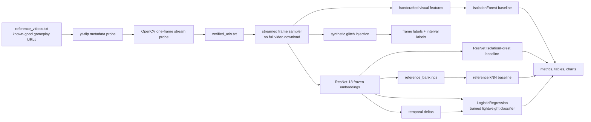

# GlitchVision

**Visual regression triage for gameplay and simulation footage.**
CPU-first. ResNet-18 embeddings + Isolation Forest, reference-based
kNN, and a hybrid blend, with segment-level analysis and a synthetic
benchmark. Streamlit UI.

GlitchVision surfaces the frames and intervals of a capture that look
suspicious — either relative to the rest of the same clip, or relative
to a known-good reference build. It is a triage aid: it tells a human
reviewer *where to look*, not *what is broken*.

---

## Why this matters

Manual QA of gameplay footage does not scale. Human reviewers can't
realistically watch every second of every build, and most automated
approaches either need labeled glitch data (which is scarce) or tight
engine integration (which an external team does not have).

GlitchVision offers a practical middle ground:

- **Build-over-build QA.** Capture reference footage from the last
  known-good build, then flag frames and segments of a new build that
  drift away from it.
- **Simulation / capture review.** Surface unusual frames in long
  capture sessions without pre-defining failure modes.
- **General visual anomaly triage.** Anywhere "this frame doesn't
  belong" is a useful signal.

## Latest benchmark snapshot

On the current synthetic injected-glitch benchmark (`80` sampled frames,
`30` positive frames, `10` URLs probed), GlitchVision produced:

- **Best thresholded frame-level baseline:** ResNet-18 +
  IsolationForest with `F1 = 0.500`, `accuracy = 0.750`,
  `precision = 1.000`, and `recall = 0.333`.
- **Strong ranking metrics:** reference kNN reached `ROC-AUC = 0.993`,
  `PR-AUC = 0.987`, `Precision@20 = 1.000`, and `Hit@20 = 1.000`.
- **Interval coverage:** the temporal LogisticRegression variant hit
  every injected anomaly interval at least once (`interval_recall =
  1.000`).
- **CPU profile:** `58.75 s` total runtime, `1.36 samples/s`,
  `196.28 MB` peak traced memory, `766.03 MB` RSS memory, and `$0.00`
  external API cost.

These numbers are generated by `scripts/run_game_benchmark.py` and are
reported from the files shown in the Streamlit **See output** tab. They
are benchmark evidence on controlled injected glitches, not a claim of
production QA accuracy.

---

## Architecture

Three scoring modes are exposed behind one pipeline API:

1. **Within-clip (Isolation Forest).** Flags frames that are
   statistically unusual inside the same clip. No reference needed.
2. **Reference distance (kNN).** Per-frame anomaly score is the mean
   cosine distance to the `k` nearest neighbors in a precomputed
   reference embedding bank.
3. **Hybrid.** Min-max normalizes each of the two scores above and
   blends them with configurable weights (default `0.5 / 0.5`).

On top of any mode, per-frame scores are aggregated into
**non-overlapping segments** so reviewers can jump directly to
suspicious intervals instead of scrubbing a timeline.

```
       Reference videos                     Candidate video
              |                                    |
              v                                    v
      +-----------------+                 +-----------------+
      | FrameExtractor  |                 | FrameExtractor  |
      | (1 fps, 224x224)|                 | (1 fps, 224x224)|
      +--------+--------+                 +--------+--------+
               |                                   |
               v                                   v
      +-----------------+                 +-----------------+
      | Backbone        |                 | Backbone        |
      | (ResNet-18 /    |                 | (same backbone) |
      |  DINO / CLIP)   |                 |                 |
      +--------+--------+                 +--------+--------+
               |                                   |
               v                                   |
      +-----------------+                          |
      |  ReferenceBank  |                          |
      |  embeddings.npz |                          |
      |  metadata.json  |                          |
      +--------+--------+                          |
               |                                   |
               +-----------------+-----------------+
                                 |
              +------------------+------------------+
              |                  |                  |
              v                  v                  v
      +---------------+  +-----------------+  +---------------+
      | Within-clip   |  | Reference kNN   |  | Hybrid blend  |
      | Isolation F.  |  | cosine / L2     |  | normalized    |
      +-------+-------+  +--------+--------+  +-------+-------+
              |                   |                   |
              +---------+---------+---------+---------+
                        |                   |
                        v                   v
              +-----------------+  +-----------------+
              | Top-K frames    |  | Top segments    |
              +--------+--------+  +--------+--------+
                       \                   /
                        \                 /
                         v               v
                  +--------------------------+
                  | anomalies.csv           |
                  | segments.csv            |
                  | score_plot.png          |
                  | report.md               |
                  | frames/rank*.jpg        |
                  +--------------------------+
```

Pipeline orchestration lives in `src/pipeline/pipeline.py`.

### Gameplay benchmark architecture



The ResNet-18 backbone is pretrained and frozen. GlitchVision does **not**
train ResNet-18; the trained model in the gameplay benchmark is a small
classifier trained on synthetic gameplay-glitch labels using embeddings and
lightweight temporal features.

---

## Repo layout

```
glitchvision/
├── app/
│   ├── main.py                 # Streamlit UI (mode selector + ref bank mgmt)
│   └── config.py
├── src/
│   ├── ingestion/              # YouTube stream resolution + local upload
│   ├── processing/             # frame sampling
│   ├── features/               # pluggable backbone (resnet18 / dino / clip)
│   ├── models/
│   │   ├── anomaly_detector.py # Isolation Forest wrapper
│   │   ├── reference_scorer.py # kNN distance to reference bank
│   │   └── hybrid_scorer.py    # normalized blend
│   ├── reference/              # durable reference embedding bank
│   ├── reporting/              # markdown run report
│   ├── benchmark/              # synthetic glitch injection + metrics
│   ├── pipeline/               # end-to-end orchestration
│   └── utils/                  # IO, scoring, segments, visualization
├── tests/                      # unit + end-to-end tests
├── data/
│   ├── samples/                # your own clips (gitignored)
│   ├── reference_banks/        # saved banks (gitignored)
│   └── outputs/                # per-run outputs (gitignored)
├── .github/workflows/ci.yml
├── requirements.txt
├── run_app.py                  # one-liner launcher
└── README.md
```

---

## Tech stack

- **Python** 3.11+ (tested through 3.14)
- **PyTorch / torchvision** (CPU build) — ResNet-18 backbone
- **scikit-learn** — Isolation Forest
- **OpenCV** — frame sampling + resize
- **NumPy** — embedding math, kNN distances, score normalization
- **Streamlit** — demo UI
- **yt-dlp** — YouTube stream resolution
- **matplotlib** — score-vs-time plot
- **pytest** — unit + end-to-end test suite
- **GitHub Actions** — CI for the lightweight unit tests

---

## Setup

Tested target: **Windows 10/11, macOS, Linux; Python 3.11–3.14; CPU
only; 8 GB RAM.**

```powershell
# 1. Create a virtual environment
python -m venv .venv
.\.venv\Scripts\Activate.ps1     # (Windows PowerShell)
# source .venv/bin/activate      # (macOS/Linux)

# 2. Install PyTorch CPU build
pip install torch torchvision

# 3. Install the rest
pip install -r requirements.txt
```

The default path only needs the dependencies in `requirements.txt`.
Optional alternate backbones are not required:

- `dino` loads `dino_vits16` via `torch.hub` (internet on first load).
- `clip` requires `pip install git+https://github.com/openai/CLIP.git`.

If an optional backbone fails to load, the app logs a warning and
falls back to ResNet-18 automatically.

---

## Running the app

```powershell
python run_app.py
```

The Streamlit UI opens in your browser.

1. Pick a **Scoring mode**:
   - *Within-clip (baseline)* — no reference needed.
   - *Reference distance* — requires a saved reference bank.
   - *Hybrid* — requires a saved reference bank.
2. Pick an **Input source**:
   - *YouTube URL* (primary) — resolved via `yt-dlp`; the source video
     is never persisted to disk.
   - *Local upload (fallback)* — for offline use or when a YouTube
     stream is not OpenCV-compatible.
3. For reference / hybrid modes, either **load an existing bank** from
   the dropdown or expand **Build a new reference bank** and upload
   one or more known-good clips.
4. Tune frame interval, top-K, contamination, segment window, etc.
5. Click **Run anomaly detection**.
6. Open the **See output** tab. The frontend shows the report,
   `anomalies.csv`, `segments.csv`, `score_plot.png`, top-frame
   thumbnails, operational metrics, optional evaluation metrics, and
   gameplay benchmark artifacts inline. There are no download buttons in
   the demo path; the app is meant to be reviewable directly in-browser.

---

## Gameplay reference workflow

Put known-good gameplay reference URLs in `data/reference_videos.txt`, one
per line. Blank lines and comments are ignored. The verifier uses `yt-dlp`
for metadata and stream resolution, rejects unavailable/private/live/
age-gated/region-blocked failures, and then runs a tiny OpenCV first-frame
probe. One bad URL is recorded as rejected; it does not stop the rest of the
workflow.

If `data/reference_videos.txt` is missing, the verifier creates it with a
commented example. The older `data/reference_banks/reference_videos.txt`
location is also recognized as a fallback for users who already placed URLs
there.

```powershell
python -m src.ingestion.url_reference_loader --urls-file data/reference_videos.txt
```

Verification outputs:

- `data/outputs/reference_verification/verified_urls.txt`
- `data/outputs/reference_verification/rejected_urls.csv`
- `data/outputs/reference_verification/verification_report.md`

Build the gameplay reference bank from verified streams:

```powershell
python scripts/build_gameplay_reference_bank.py `
  --urls-file data/reference_videos.txt `
  --interval-sec 5 `
  --max-samples-per-video 120 `
  --max-videos 20 `
  --image-size 224 `
  --out-dir data/reference_banks/gameplay_reference
```

The builder stores only derived artifacts:

- `reference_bank.npz`
- `reference_bank_metadata.json`
- `thumbnail_grid.jpg` when frames are available

It filters near-black frames, near-identical consecutive frames, and only
uses a conservative low-variance/low-edge heuristic for obvious static
menu/loading screens. Menu detection is intentionally limited because a
false-positive filter can remove valid gameplay.

---

## Synthetic gameplay glitch benchmark

The gameplay benchmark samples known-good frames, injects labeled glitches,
and compares baselines against a trained lightweight classifier. Supported
synthetic glitches include brightness shift, contrast shift, blur, Gaussian
noise, black frame, HUD-style block occlusion, freeze/stutter, and temporal
jump/reorder. The benchmark writes small debug examples to
`data/outputs/game_benchmark/debug_glitches/`.

Run a small CPU-friendly benchmark:

```powershell
python scripts/run_game_benchmark.py `
  --urls-file data/reference_videos.txt `
  --max-videos 2 `
  --max-samples-per-video 24 `
  --interval-sec 5 `
  --eval-interval-sec 1.5 `
  --image-size 224 `
  --out-dir data/outputs/game_benchmark
```

Run a larger benchmark:

```powershell
python scripts/run_game_benchmark.py `
  --urls-file data/reference_videos.txt `
  --max-videos 10 `
  --max-samples-per-video 80 `
  --interval-sec 5 `
  --eval-interval-sec 1.5 `
  --image-size 224 `
  --out-dir data/outputs/game_benchmark
```

If all URLs are unavailable, the runner fails gracefully by recording URL
rejections and using a tiny synthetic gameplay-like fallback clip so the
benchmark code path can still be exercised locally.

### Baselines vs trained model

The benchmark compares:

| Model | Role | Notes |
| --- | --- | --- |
| Handcrafted + IsolationForest | Baseline 1 | Color histogram, brightness mean/std, edge density, blur estimate. |
| ResNet-18 + IsolationForest | Baseline 2 | Stronger unsupervised baseline over frozen pretrained embeddings. |
| ResNet-18 + reference kNN | Reference baseline | Distance to known-good reference bank; higher distance is more anomalous. |
| ResNet-18 + temporal features + LogisticRegression | Trained model | Lightweight classifier trained on synthetic gameplay glitch labels. |

### Metrics explained

All scores follow the convention **higher = more anomalous**.

- Accuracy, precision, recall, and F1 summarize thresholded frame-level classification.
- ROC-AUC measures ranking quality across thresholds when both classes exist.
- PR-AUC / average precision emphasizes rare anomaly retrieval.
- Precision@K asks how many of the top-K flagged frames are truly anomalous.
- Recall@K asks how many anomalous frames appear in the top-K.
- Hit@K asks whether at least one top-K frame hits an anomaly.
- Confusion matrix shows normal/anomaly thresholded errors.
- Interval recall asks how many injected anomaly spans were hit at least once.
- Segment IoU measures overlap between predicted anomalous spans and injected spans.

### Benchmark outputs

The runner writes:

- `benchmark_results.csv` and `benchmark_results.json`
- `benchmark_table.md`
- `ablation_table.csv` and `ablation_table.md`
- `profiling_report.csv` and `profiling_report.json`
- `cost_report.md`
- `metric_bar_chart.png`
- `roc_pr_curves.png`
- `latency_memory_chart.png`
- `confusion_matrices.png`
- `sample_predictions_grid.png`

### Benchmark results table

The numbers below come from the generated artifacts currently shown in
the **See output** tab:

- Source artifacts: `data/outputs/game_benchmark/benchmark_results.json`,
  `benchmark_results.csv`, `profiling_report.json`, and `cost_report.md`.
- Run scope: **10 URLs probed**, **80 sampled frames**, **30 injected
  positive anomaly frames**, default seed/config from
  `scripts/run_game_benchmark.py`.
- Important interpretation: this is a controlled synthetic
  injected-glitch benchmark for comparing model variants on the same
  data. It is useful for engineering validation and recruiter-facing
  evidence, but it is not a claim of production QA accuracy.

| Model | Accuracy | Precision | Recall | F1 | ROC-AUC | PR-AUC | Precision@20 | Recall@20 | Hit@20 | Interval recall | Segment IoU | Latency |
| --- | ---: | ---: | ---: | ---: | ---: | ---: | ---: | ---: | ---: | ---: | ---: | ---: |
| Handcrafted + IsolationForest | 0.725 | 1.000 | 0.267 | 0.421 | 1.000 | 1.000 | 1.000 | 0.667 | 1.000 | 0.667 | 0.267 | 1.918 s |
| ResNet-18 + IsolationForest | **0.750** | 1.000 | **0.333** | **0.500** | 0.954 | 0.917 | 0.900 | 0.600 | 1.000 | 0.833 | **0.333** | 1.486 s |
| ResNet-18 + reference kNN | 0.725 | 1.000 | 0.267 | 0.421 | 0.993 | 0.987 | 1.000 | 0.667 | 1.000 | 0.833 | 0.267 | **0.003 s** |
| ResNet-18 + temporal + trained LogisticRegression | 0.725 | 1.000 | 0.267 | 0.421 | 1.000 | 1.000 | 1.000 | 0.667 | 1.000 | **1.000** | 0.267 | 0.015 s |

Read the table row-wise: higher classification and ranking metrics are
better; lower latency is better. The strongest thresholded frame-level
baseline in this run is **ResNet-18 + IsolationForest** (`F1 = 0.500`,
`accuracy = 0.750`). The fastest scorer is **reference kNN** because the
reference embeddings are already computed (`0.003 s` scoring latency).
The trained temporal classifier achieves perfect interval recall on this
run (`1.000`), meaning every injected anomaly span was hit at least once
in the top ranked frames.

### Latency, memory, and cost profiling

Profiling uses `time.perf_counter`, `tracemalloc`, and `psutil` when
available. It reports URL verification, frame sampling, feature extraction,
training, scoring, evaluation, report generation, total runtime, peak memory,
samples/sec, ms/sample, model artifact size, reference bank size, videos
probed, and frames sampled.

Latest benchmark profile:

| Metric | Value |
| --- | ---: |
| Total runtime | 58.75 s |
| URL verification | 16.29 s |
| Frame sampling | 32.20 s |
| Feature extraction | 2.69 s |
| Scoring | 3.42 s |
| Training | 0.06 s |
| Evaluation | 0.12 s |
| Report / chart generation | 3.96 s |
| Throughput | 1.36 samples/s |
| Latency per sample | 734.41 ms |
| Peak traced memory | 196.28 MB |
| RSS memory | 766.03 MB |
| Model artifact size | 0.017 MB |
| Reference bank artifact size | 0.001 MB |
| API cost | $0.00 |

Default API cost is `$0.00` because GlitchVision does not call paid external
APIs. The local compute cost proxy is runtime, RAM, disk storage, number of
videos probed, and number of frames sampled.

### Ablation study

The ablation table compares handcrafted-only features, ResNet embeddings,
reference kNN, temporal deltas, and the trained classifier. Optional sampling
interval comparisons can be added when cheap enough for the local machine.

### Temporal modeling

`src/features/temporal_features.py` adds embedding delta L2, cosine distance
to previous frame, rolling delta mean/std, freeze/stutter signal, and
sudden-jump signal. This is deliberately lightweight temporal anomaly
modeling, not a full video transformer.

### Build a reference bank programmatically

```python
from src.pipeline import GlitchVisionPipeline, PipelineConfig

pipe = GlitchVisionPipeline(PipelineConfig(interval_sec=1.0, backbone="resnet18"))
bank = pipe.build_reference(
    [("data/samples/known_good_run1.mp4", "known_good_run1"),
     ("data/samples/known_good_run2.mp4", "known_good_run2")],
    out_dir="data/reference_banks/known_good_v1",
)
print("Bank size:", bank.size)
```

### Run a candidate clip in reference mode

```python
from src.pipeline import GlitchVisionPipeline, PipelineConfig
from src.reference import ReferenceBank

bank = ReferenceBank.load("data/reference_banks/known_good_v1")
pipe = GlitchVisionPipeline(PipelineConfig(
    interval_sec=1.0,
    mode="reference_distance",
    top_k=12,
    reference_k=5,
))
result = pipe.run(
    video_source="data/samples/candidate_build.mp4",
    source_type="local_upload",
    source_label="candidate_build.mp4",
    reference_bank=bank,
)
print("Run dir:", result.run_dir)
```

### Run the synthetic benchmark

The benchmark utilities let you sanity-check the pipeline on known
corrupted intervals. Ground truth is the injection schedule itself.

```python
from src.benchmark import plan_glitch_schedule, inject_glitches, evaluate_run

# `clean_frames` is a list of BGR uint8 frames sampled from a clean clip.
schedule = plan_glitch_schedule(n_frames=len(clean_frames), n_intervals=3, seed=0)
corrupted, intervals = inject_glitches(clean_frames, schedule, seed=0)

# Write `corrupted` to a file and run the pipeline on it, then:
metrics = evaluate_run(
    top_frame_indices=[r.frame_index for r in result.top_records],
    ground_truth=intervals,
    n_sampled_frames=result.total_sampled_frames,
    top_segment_ranges=[(s.start_frame, s.end_frame) for s in result.top_segments],
)
print(metrics)
```

Benchmark numbers are only meaningful relative to a specific clip,
schedule, and seed. The benchmark table above records the latest local
run so recruiters can inspect concrete evidence, while the raw generated
artifacts remain gitignored.

---

## Output artifacts

Each run creates a timestamped folder under `data/outputs/run_<ts>/`:

| File | Description |
| --- | --- |
| `anomalies.csv`    | Per-sampled-frame scores (rank, timestamp, raw + normalized scores, within/reference components, mode). |
| `segments.csv`     | Top anomalous segments with start/end time and representative frame. |
| `score_plot.png`   | Score-vs-time curve with top-K frames highlighted. |
| `run_metrics.json` | Operational metrics: wall time, sampled frames/sec, embedding throughput, and score distribution. |
| `eval_metrics.json` | Optional supervised metrics when labeled sampled-frame indices are provided. |
| `report.md`        | Human-readable run summary (config, top frames, top segments, limitations). |
| `frames/rank*.jpg` | Thumbnail JPEGs of the top-K anomalous frames. |

Reference banks live under `data/reference_banks/<name>/` as
`embeddings.npz` + `metadata.json`.

Run outputs, sample clips, reference banks, local model artifacts,
YouTube URL lists, cookies, and Streamlit local config are all
**gitignored** because they are user-specific, regenerated per run, or
potentially private. The README documents the benchmark numbers above so
reviewers can understand the result without committing raw local data.

---

## Run tests

```powershell
pytest -q
```

The suite covers:

- scoring and I/O utilities,
- reference-bank save/load round-trip,
- kNN reference scorer,
- hybrid blend math,
- segment aggregation,
- synthetic glitch injection and benchmark metrics,
- report builder,
- end-to-end run in within-clip mode,
- end-to-end run in reference and hybrid modes on a synthetic clip.

CI (`.github/workflows/ci.yml`) runs the lightweight unit tests on
every push / PR. The heavy end-to-end tests (which pull torch and
OpenCV) are run locally against your `.venv`.

---

## Technical design decisions

- **ResNet-18 default.** 512-D pooled features, ~11M params, fast on
  CPU, robust ImageNet representation. Good enough for frame-level
  outlier detection without a training loop.
- **Pluggable backbone registry.** `dino` and `clip` are wired via a
  small factory so future experimentation is easy. *No backbone is
  trained from scratch in this project;* the optional paths use
  pretrained checkpoints.
- **Isolation Forest for within-clip scoring.** Unsupervised, fast on
  CPU, one meaningful knob (`contamination`), well-understood
  baseline.
- **kNN for reference-distance scoring.** Real reference captures are
  multi-modal (menus, cutscenes, combat). kNN naturally respects the
  modes; a single-centroid model would not. Its one hyperparameter
  (`k`) has a clear meaning.
- **L2-normalized embeddings.** Make cosine and Euclidean distance
  interchangeable up to a monotone transform and keep the distance
  matrix numerically stable.
- **Segment-level aggregation.** Reviewers care about intervals, not
  isolated frames. Non-overlapping windows map 1:1 to segment IDs on
  disk and avoid top-K dedup confusion.
- **YouTube ingestion via resolved stream URL.** No persistent
  download of the source video. If OpenCV can't open the chosen
  format, the app fails loudly and points the user at the
  local-upload fallback.
- **`max_frames` safety cap.** A hard rail against runaway runs on a
  laptop.

---

## Limitations

- **Unsupervised ≠ bug detector.** Scores are *statistical* outliers.
  Cutscenes, menus, and fade-to-black frames can score high without
  being bugs. Every output is a candidate for human review.
- **Per-frame backbone.** ResNet-18 sees each frame independently;
  true motion anomalies (stuck animations, frozen physics) need
  temporal modeling (see roadmap).
- **Synthetic benchmark is a proxy.** Injected glitches are not a
  substitute for real QA data; benchmark numbers are sanity checks,
  not production KPIs.
- **Reference generalization is bounded.** A reference bank only
  covers the scenes it has actually seen; genuinely new content will
  look anomalous to the reference scorer.
- **YouTube stream compatibility varies.** DASH-only videos still
  require the local-upload fallback.
- **CPU-only by default.** GPU support is a one-line change
  (`device="cuda"`) but is not officially tested here.

---

## Roadmap

- **Temporal modeling** — short-window embedding deltas or a small
  temporal head to catch motion-related regressions.
- **Better stream ingestion** — thin FFmpeg wrapper for DASH streams.
- **Segment-level contact sheets** — one image per top segment for
  faster human triage.
- **Reference bank curation** — filtering and deduplication so banks
  stay compact as more known-good captures accumulate.
- **Optional fine-tune hook** — a light contrastive head on top of the
  frozen backbone, trained on domain-specific footage.

---
