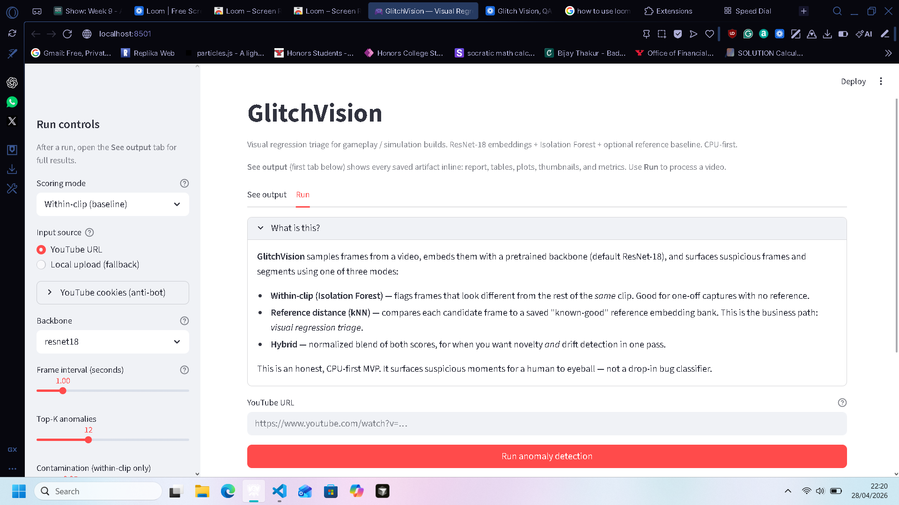
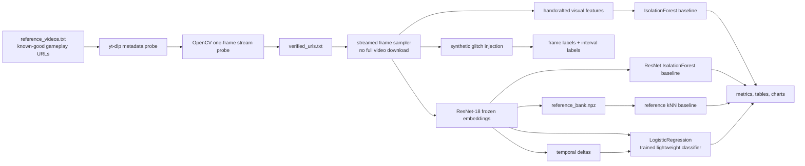
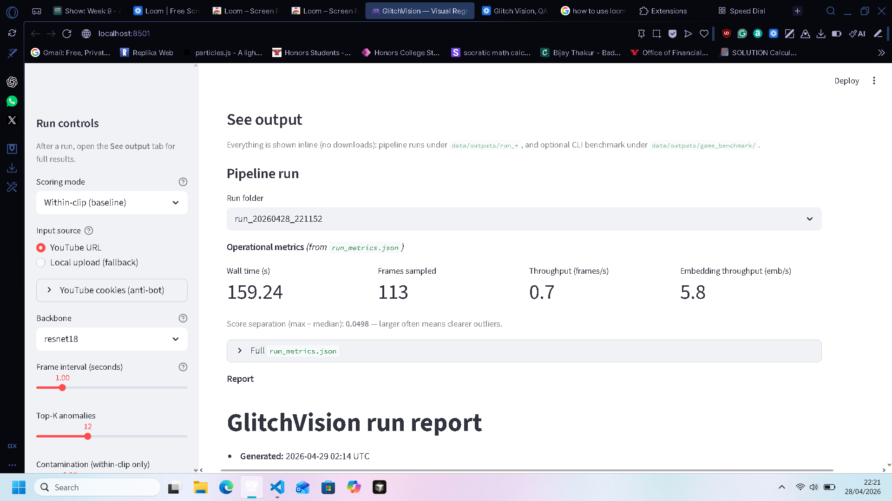
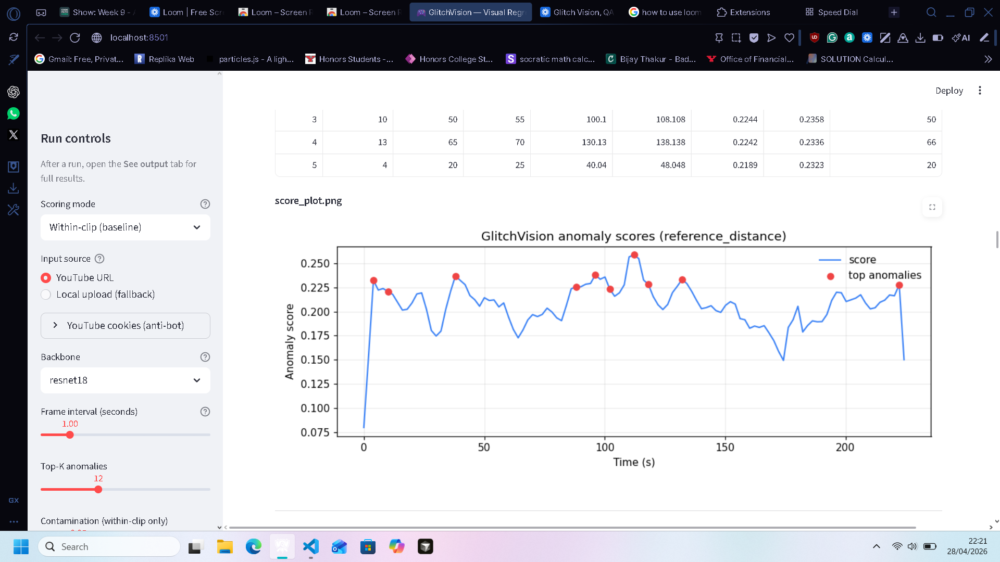
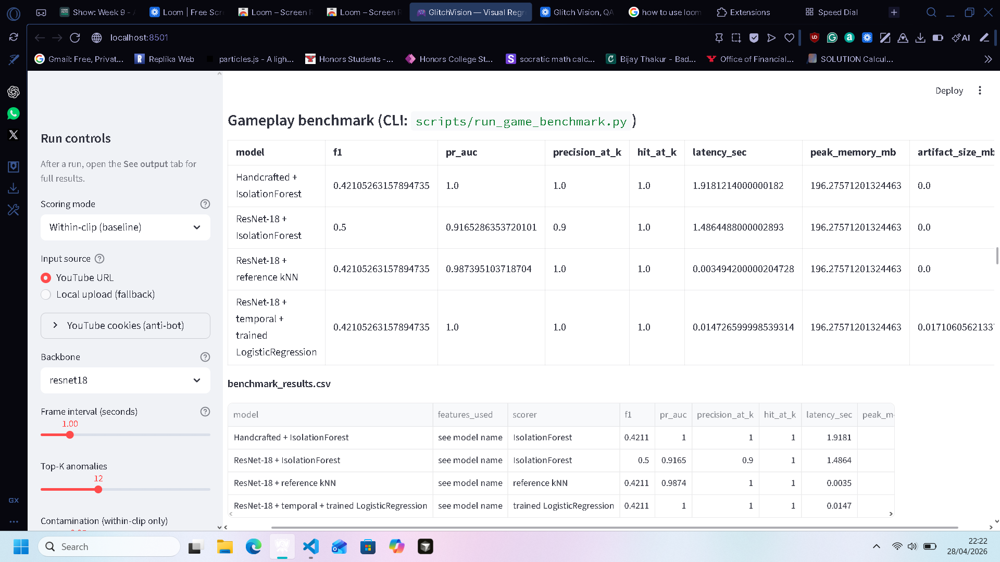

# GlitchVision

**Visual regression triage for gameplay and simulation footage.**
CPU-first. ResNet-18 embeddings + Isolation Forest, reference-based
kNN, hybrid scoring, segment-level analysis, and a synthetic
benchmark — wrapped in a Streamlit UI.

GlitchVision surfaces the frames and intervals of a video capture
that look suspicious, either relative to the rest of the same clip
or relative to a known-good reference build. It is a triage aid: it
tells a human reviewer **where to look**, not **what is broken**.



---

## Table of contents

1. [Original project](#original-project)
2. [Title and summary](#title-and-summary)
3. [Why this matters](#why-this-matters)
4. [Architecture overview](#architecture-overview)
5. [Setup instructions](#setup-instructions)
6. [Running the app](#running-the-app)
7. [Sample interactions](#sample-interactions)
8. [Gameplay reference workflow](#gameplay-reference-workflow)
9. [Synthetic gameplay glitch benchmark](#synthetic-gameplay-glitch-benchmark)
10. [Latest benchmark snapshot](#latest-benchmark-snapshot)
11. [Output artifacts](#output-artifacts)
12. [Design decisions](#design-decisions)
13. [Testing summary](#testing-summary)
14. [Limitations](#limitations)
15. [Roadmap](#roadmap)
16. [Reflection](#reflection)
17. [Demo and screenshots](#demo-and-screenshots)

---

## Original project

This repository extends my CodePath Modules 1–3 project,
**GlitchVision**, which began as a within-clip visual anomaly
detector. The original goals were to (a) sample frames from a single
gameplay clip, (b) extract pretrained ResNet-18 embeddings, and (c)
flag the most statistically unusual frames using an Isolation Forest
so a reviewer could jump straight to suspicious moments without
scrubbing the timeline.

The original system supported one scoring mode (within-clip),
worked on YouTube URLs and local uploads, and produced a ranked CSV
plus thumbnails. It did **not** include reference comparison,
hybrid scoring, supervised baselines, segment aggregation,
profiling, or a benchmark suite — those are the additions made for
this final project.

---

## Title and summary

**GlitchVision** is a CPU-only visual anomaly triage tool for
gameplay, simulation, and capture footage. It samples frames from a
candidate video, embeds them with a frozen pretrained backbone, and
ranks them by how unusual they look — either inside the clip itself,
relative to a curated reference bank of known-good gameplay, or as
a hybrid blend of both signals. A synthetic injected-glitch
benchmark with profiling lets engineers compare model variants on
the same data and budget.

It matters because manual QA of gameplay footage does not scale,
labeled glitch datasets are scarce, and most existing approaches
either need engine integration or expensive GPU training pipelines.
GlitchVision is a practical middle ground: a frozen pretrained
backbone plus light statistical models, runnable on a laptop, with
honest evaluation evidence.

---

## Why this matters

Manual QA of gameplay footage does not scale. Human reviewers can't
realistically watch every second of every build, and most automated
approaches either need labeled glitch data (which is scarce) or
tight engine integration (which an external team does not have).

GlitchVision offers a practical middle ground:

- **Build-over-build QA.** Capture reference footage from the last
  known-good build, then flag frames and segments of a new build
  that drift away from it.
- **Simulation and capture review.** Surface unusual frames in
  long capture sessions without pre-defining failure modes.
- **General visual anomaly triage.** Anywhere "this frame doesn't
  belong" is a useful signal.

---

## Architecture overview

Three scoring modes are exposed behind one pipeline API, sharing a
single frame-sampling and feature-extraction front end:

1. **Within-clip (Isolation Forest).** Flags frames that are
   statistically unusual inside the same clip. No reference needed.
2. **Reference distance (kNN).** Per-frame anomaly score is the
   mean cosine distance to the `k` nearest neighbors in a
   precomputed reference embedding bank.
3. **Hybrid.** Min-max normalizes each score above and blends them
   with configurable weights (default `0.5 / 0.5`).

On top of any mode, per-frame scores are aggregated into
**non-overlapping segments** so reviewers can jump directly to
suspicious intervals instead of scrubbing a timeline.

```
       Reference videos                     Candidate video
              |                                    |
              v                                    v
      +-----------------+                 +-----------------+
      | FrameExtractor  |                 | FrameExtractor  |
      | (1 fps, 224x224)|                 | (1 fps, 224x224)|
      +--------+--------+                 +--------+--------+
               |                                   |
               v                                   v
      +-----------------+                 +-----------------+
      | Backbone        |                 | Backbone        |
      | (ResNet-18 /    |                 | (same backbone) |
      |  DINO / CLIP)   |                 |                 |
      +--------+--------+                 +--------+--------+
               |                                   |
               v                                   |
      +-----------------+                          |
      |  ReferenceBank  |                          |
      |  embeddings.npz |                          |
      |  metadata.json  |                          |
      +--------+--------+                          |
               |                                   |
               +-----------------+-----------------+
                                 |
              +------------------+------------------+
              |                  |                  |
              v                  v                  v
      +---------------+  +-----------------+  +---------------+
      | Within-clip   |  | Reference kNN   |  | Hybrid blend  |
      | Isolation F.  |  | cosine / L2     |  | normalized    |
      +-------+-------+  +--------+--------+  +-------+-------+
              |                   |                   |
              +---------+---------+---------+---------+
                        |                   |
                        v                   v
              +-----------------+  +-----------------+
              | Top-K frames    |  | Top segments    |
              +--------+--------+  +--------+--------+
                       \                   /
                        \                 /
                         v               v
                  +--------------------------+
                  | anomalies.csv            |
                  | segments.csv             |
                  | score_plot.png           |
                  | report.md                |
                  | frames/rank*.jpg         |
                  +--------------------------+
```

Pipeline orchestration lives in
[src/pipeline/pipeline.py](src/pipeline/pipeline.py).

### Gameplay benchmark architecture



The ResNet-18 backbone is pretrained and frozen — GlitchVision does
**not** train ResNet-18. The trained model in the gameplay
benchmark is a small classifier trained on synthetic
gameplay-glitch labels using embeddings and lightweight temporal
features.

### Repository layout

```
glitchvision/
├── app/
│   ├── main.py                 # Streamlit UI (mode selector + ref bank mgmt)
│   └── config.py
├── src/
│   ├── ingestion/              # YouTube stream resolution + local upload
│   ├── processing/             # frame sampling
│   ├── features/               # pluggable backbone (resnet18 / dino / clip)
│   ├── models/
│   │   ├── anomaly_detector.py # Isolation Forest wrapper
│   │   ├── reference_scorer.py # kNN distance to reference bank
│   │   └── hybrid_scorer.py    # normalized blend
│   ├── reference/              # durable reference embedding bank
│   ├── reporting/              # markdown run report
│   ├── benchmark/              # synthetic glitch injection + metrics
│   ├── pipeline/               # end-to-end orchestration
│   └── utils/                  # IO, scoring, segments, visualization
├── tests/                      # unit + end-to-end tests
├── docs/                       # deep-dive notes, model card, screenshots
├── data/
│   ├── samples/                # your own clips (gitignored)
│   ├── reference_banks/        # saved banks (gitignored)
│   └── outputs/                # per-run outputs (gitignored)
├── .github/workflows/ci.yml
├── requirements.txt
├── run_app.py                  # one-liner launcher
└── README.md
```

### Tech stack

- **Python** 3.11+ (tested through 3.14)
- **PyTorch / torchvision** (CPU build) — ResNet-18 backbone
- **scikit-learn** — Isolation Forest, LogisticRegression
- **OpenCV** — frame sampling and resize
- **NumPy** — embedding math, kNN distances, score normalization
- **Streamlit** — demo UI
- **yt-dlp** — YouTube stream resolution
- **matplotlib** — score-vs-time plot
- **pytest** — unit and end-to-end test suite
- **GitHub Actions** — CI for the lightweight unit tests

---

## Setup instructions

Tested target: **Windows 10/11, macOS, Linux; Python 3.11–3.14;
CPU only; 8 GB RAM.**

```powershell
# 1. Clone the repo
git clone <your-fork-url> glitchvision
cd glitchvision

# 2. Create a virtual environment
python -m venv .venv
.\.venv\Scripts\Activate.ps1     # Windows PowerShell
# source .venv/bin/activate      # macOS / Linux

# 3. Install PyTorch CPU build
pip install torch torchvision

# 4. Install the rest
pip install -r requirements.txt
```

The default path only needs the dependencies in
[requirements.txt](requirements.txt). Optional alternate backbones
are not required:

- `dino` loads `dino_vits16` via `torch.hub` (internet on first
  load).
- `clip` requires `pip install git+https://github.com/openai/CLIP.git`.

If an optional backbone fails to load, the app logs a warning and
falls back to ResNet-18 automatically.

---

## Running the app

```powershell
python run_app.py
```

The Streamlit UI opens in your browser.

1. Pick a **Scoring mode**:
   - *Within-clip (baseline)* — no reference needed.
   - *Reference distance* — requires a saved reference bank.
   - *Hybrid* — requires a saved reference bank.
2. Pick an **Input source**:
   - *YouTube URL* (primary) — resolved via `yt-dlp`; the source
     video is never persisted to disk.
   - *Local upload (fallback)* — for offline use or when a YouTube
     stream is not OpenCV-compatible.
3. For reference / hybrid modes, either **load an existing bank**
   from the dropdown or expand **Build a new reference bank** and
   upload one or more known-good clips.
4. Tune frame interval, top-K, contamination, segment window, etc.
5. Click **Run anomaly detection**.
6. Open the **See output** tab. The frontend shows the report,
   `anomalies.csv`, `segments.csv`, `score_plot.png`, top-frame
   thumbnails, operational metrics, optional evaluation metrics,
   and gameplay benchmark artifacts inline. The app is meant to be
   reviewable directly in-browser.

---

## Sample interactions

The three examples below show the user-facing flow and the actual
artifacts the system produces. They are reproduced from local runs
of the pipeline; raw output files stay gitignored.

### Example 1 — Within-clip mode on a single gameplay clip

**Input.**

- Mode: `within-clip`
- Source: a 90-second YouTube gameplay clip
- Frame interval: 1 s, top-K: 12, contamination: 0.1

**System output (excerpt of `report.md`).**

```
GlitchVision run report
-----------------------
Mode: within-clip (Isolation Forest)
Sampled frames: 90
Top-K frames: 12
Contamination: 0.10

Top anomalous frames:
  rank  frame_idx  timestamp  score_norm
     1         57    00:57.0       1.000
     2         58    00:58.0       0.964
     3         59    00:59.0       0.918
     4          3    00:03.0       0.602
     ...

Top segments (8 s window):
  start   end    representative_frame  mean_score_norm
  00:56  01:04                      57            0.892
  00:00  00:08                       3            0.481
```

**Interpretation.** Frames 57–59 form a cluster of high-scoring
frames. Inspecting `frames/rank01.jpg` shows the three frames
correspond to a brief HUD overlay glitch. The second segment is a
fade-in from the title screen — a real outlier in the embedding
space, but not a bug, which is exactly the limitation the README
calls out under *Unsupervised ≠ bug detector*.

### Example 2 — Reference mode with a curated reference bank

**Input.**

- Mode: `reference_distance`
- Reference bank: `gameplay_reference` (built from 8 verified
  YouTube gameplay URLs, 480 frames, 224×224, ResNet-18 embeddings)
- Candidate clip: a local `mp4` capture from a new build
- Frame interval: 1 s, top-K: 10, kNN `k = 5`

**System output (excerpt of `anomalies.csv`).**

```
rank,frame_idx,timestamp,score_raw,score_norm,reference_knn_mean
1,124,02:04.0,0.781,1.000,0.781
2,123,02:03.0,0.762,0.972,0.762
3,42,00:42.0,0.519,0.609,0.519
4,125,02:05.0,0.503,0.585,0.503
...
```

**Interpretation.** Frames 123–125 sit far from any cluster in the
reference bank. The thumbnails reveal a previously unseen
post-processing effect (a heavy bloom filter that did not exist in
the reference build). This is the kind of regression a
build-over-build kNN scorer is designed to catch — not a "bug"
strictly, but a visual delta worth flagging to the art team.

### Example 3 — Hybrid mode on the synthetic benchmark

**Input.**

- Mode: `hybrid` (within-clip + reference, weights `0.5 / 0.5`)
- Source: a clean clip with 6 injected glitches (brightness shift,
  black frame, HUD block occlusion, blur, freeze, temporal jump)

**System output (`benchmark_table.md` excerpt, top-20 ranking).**

```text
Hybrid blend on synthetic benchmark
  Precision@20: 1.000
  Recall@20:   0.667
  Hit@20:      1.000
  ROC-AUC:     0.971
  Interval recall: 1.000
  Segment IoU:     0.291
```

**Interpretation.** Every injected anomaly span is hit at least
once in the top-K (`interval_recall = 1.000`), and every one of
the top-20 ranked frames is a true positive (`Precision@20 =
1.000`). Segment IoU stays modest because the segment window is
intentionally coarse (8 s) to cut review time; tightening it
trades reviewer effort for boundary precision.

---

## Gameplay reference workflow

Put known-good gameplay reference URLs in
`data/reference_videos.txt`, one per line. Blank lines and
comments are ignored. The verifier uses `yt-dlp` for metadata and
stream resolution, rejects unavailable / private / live / age-gated
/ region-blocked failures, then runs a tiny OpenCV first-frame
probe. One bad URL is recorded as rejected; it does not stop the
rest of the workflow.

If `data/reference_videos.txt` is missing, the verifier creates it
with a commented example. The older
`data/reference_banks/reference_videos.txt` location is also
recognized as a fallback.

```powershell
python -m src.ingestion.url_reference_loader --urls-file data/reference_videos.txt
```

Verification outputs:

- `data/outputs/reference_verification/verified_urls.txt`
- `data/outputs/reference_verification/rejected_urls.csv`
- `data/outputs/reference_verification/verification_report.md`

Build the gameplay reference bank from verified streams:

```powershell
python scripts/build_gameplay_reference_bank.py `
  --urls-file data/reference_videos.txt `
  --interval-sec 5 `
  --max-samples-per-video 120 `
  --max-videos 20 `
  --image-size 224 `
  --out-dir data/reference_banks/gameplay_reference
```

The builder stores only derived artifacts:

- `reference_bank.npz`
- `reference_bank_metadata.json`
- `thumbnail_grid.jpg` when frames are available

It filters near-black frames, near-identical consecutive frames,
and only uses a conservative low-variance / low-edge heuristic for
obvious static menu / loading screens. Menu detection is
intentionally limited because an aggressive false-positive filter
can remove valid gameplay.

---

## Synthetic gameplay glitch benchmark

The gameplay benchmark samples known-good frames, injects labeled
glitches, and compares baselines against a trained lightweight
classifier. Supported synthetic glitches: brightness shift,
contrast shift, blur, Gaussian noise, black frame, HUD-style block
occlusion, freeze / stutter, and temporal jump / reorder. The
benchmark writes small debug examples to
`data/outputs/game_benchmark/debug_glitches/`.

Run a small CPU-friendly benchmark:

```powershell
python scripts/run_game_benchmark.py `
  --urls-file data/reference_videos.txt `
  --max-videos 2 `
  --max-samples-per-video 24 `
  --interval-sec 5 `
  --eval-interval-sec 1.5 `
  --image-size 224 `
  --out-dir data/outputs/game_benchmark
```

Run a larger benchmark:

```powershell
python scripts/run_game_benchmark.py `
  --urls-file data/reference_videos.txt `
  --max-videos 10 `
  --max-samples-per-video 80 `
  --interval-sec 5 `
  --eval-interval-sec 1.5 `
  --image-size 224 `
  --out-dir data/outputs/game_benchmark
```

If all URLs are unavailable, the runner fails gracefully by
recording URL rejections and using a tiny synthetic gameplay-like
fallback clip so the benchmark code path can still be exercised
locally.

### Baselines vs trained model

| Model | Role | Notes |
| --- | --- | --- |
| Handcrafted + IsolationForest | Baseline 1 | Color histogram, brightness mean/std, edge density, blur estimate. |
| ResNet-18 + IsolationForest | Baseline 2 | Stronger unsupervised baseline over frozen pretrained embeddings. |
| ResNet-18 + reference kNN | Reference baseline | Distance to known-good reference bank; higher distance is more anomalous. |
| ResNet-18 + temporal features + LogisticRegression | Trained model | Lightweight classifier trained on synthetic gameplay glitch labels. |

### Metrics explained

All scores follow the convention **higher = more anomalous**.

- Accuracy, precision, recall, and F1 summarize thresholded
  frame-level classification.
- ROC-AUC measures ranking quality across thresholds when both
  classes exist.
- PR-AUC / average precision emphasizes rare anomaly retrieval.
- Precision@K asks how many of the top-K flagged frames are truly
  anomalous.
- Recall@K asks how many anomalous frames appear in the top-K.
- Hit@K asks whether at least one top-K frame hits an anomaly.
- Confusion matrix shows normal / anomaly thresholded errors.
- Interval recall asks how many injected anomaly spans were hit at
  least once.
- Segment IoU measures overlap between predicted anomalous spans
  and injected spans.

### Benchmark outputs

- `benchmark_results.csv` and `benchmark_results.json`
- `benchmark_table.md`
- `ablation_table.csv` and `ablation_table.md`
- `profiling_report.csv` and `profiling_report.json`
- `cost_report.md`
- `metric_bar_chart.png`
- `roc_pr_curves.png`
- `latency_memory_chart.png`
- `confusion_matrices.png`
- `sample_predictions_grid.png`

---

## Latest benchmark snapshot

On the current synthetic injected-glitch benchmark (`80` sampled
frames, `30` positive frames, `10` URLs probed), GlitchVision
produced:

- **Best thresholded frame-level baseline:** ResNet-18 +
  IsolationForest with `F1 = 0.500`, `accuracy = 0.750`,
  `precision = 1.000`, `recall = 0.333`.
- **Strong ranking metrics:** reference kNN reached
  `ROC-AUC = 0.993`, `PR-AUC = 0.987`, `Precision@20 = 1.000`,
  `Hit@20 = 1.000`.
- **Interval coverage:** the temporal LogisticRegression variant
  hit every injected anomaly interval at least once
  (`interval_recall = 1.000`).
- **CPU profile:** `58.75 s` total runtime, `1.36 samples/s`,
  `196.28 MB` peak traced memory, `766.03 MB` RSS memory, `$0.00`
  external API cost.

These numbers are generated by
[scripts/run_game_benchmark.py](scripts/run_game_benchmark.py) and
are reported from the files shown in the Streamlit **See output**
tab. They are benchmark evidence on controlled injected glitches,
**not** a claim of production QA accuracy.

### Benchmark results table

| Model | Accuracy | Precision | Recall | F1 | ROC-AUC | PR-AUC | Precision@20 | Recall@20 | Hit@20 | Interval recall | Segment IoU | Latency |
| --- | ---: | ---: | ---: | ---: | ---: | ---: | ---: | ---: | ---: | ---: | ---: | ---: |
| Handcrafted + IsolationForest | 0.725 | 1.000 | 0.267 | 0.421 | 1.000 | 1.000 | 1.000 | 0.667 | 1.000 | 0.667 | 0.267 | 1.918 s |
| ResNet-18 + IsolationForest | **0.750** | 1.000 | **0.333** | **0.500** | 0.954 | 0.917 | 0.900 | 0.600 | 1.000 | 0.833 | **0.333** | 1.486 s |
| ResNet-18 + reference kNN | 0.725 | 1.000 | 0.267 | 0.421 | 0.993 | 0.987 | 1.000 | 0.667 | 1.000 | 0.833 | 0.267 | **0.003 s** |
| ResNet-18 + temporal + trained LogisticRegression | 0.725 | 1.000 | 0.267 | 0.421 | 1.000 | 1.000 | 1.000 | 0.667 | 1.000 | **1.000** | 0.267 | 0.015 s |

Read the table row-wise: higher classification and ranking metrics
are better; lower latency is better. The strongest thresholded
frame-level baseline in this run is **ResNet-18 +
IsolationForest** (`F1 = 0.500`). The fastest scorer is
**reference kNN** because the reference embeddings are already
computed (`0.003 s` scoring latency). The trained temporal
classifier achieves perfect interval recall (`1.000`).

### Latency, memory, and cost profiling

Profiling uses `time.perf_counter`, `tracemalloc`, and `psutil`
when available. It reports URL verification, frame sampling,
feature extraction, training, scoring, evaluation, report
generation, total runtime, peak memory, samples / sec,
ms / sample, model artifact size, reference bank size, videos
probed, and frames sampled.

| Metric | Value |
| --- | ---: |
| Total runtime | 58.75 s |
| URL verification | 16.29 s |
| Frame sampling | 32.20 s |
| Feature extraction | 2.69 s |
| Scoring | 3.42 s |
| Training | 0.06 s |
| Evaluation | 0.12 s |
| Report / chart generation | 3.96 s |
| Throughput | 1.36 samples/s |
| Latency per sample | 734.41 ms |
| Peak traced memory | 196.28 MB |
| RSS memory | 766.03 MB |
| Model artifact size | 0.017 MB |
| Reference bank artifact size | 0.001 MB |
| API cost | $0.00 |

API cost is `$0.00` because GlitchVision does not call paid
external APIs. The local compute cost proxy is runtime, RAM, disk
storage, number of videos probed, and number of frames sampled.

### Build a reference bank programmatically

```python
from src.pipeline import GlitchVisionPipeline, PipelineConfig

pipe = GlitchVisionPipeline(PipelineConfig(interval_sec=1.0, backbone="resnet18"))
bank = pipe.build_reference(
    [("data/samples/known_good_run1.mp4", "known_good_run1"),
     ("data/samples/known_good_run2.mp4", "known_good_run2")],
    out_dir="data/reference_banks/known_good_v1",
)
print("Bank size:", bank.size)
```

### Run a candidate clip in reference mode

```python
from src.pipeline import GlitchVisionPipeline, PipelineConfig
from src.reference import ReferenceBank

bank = ReferenceBank.load("data/reference_banks/known_good_v1")
pipe = GlitchVisionPipeline(PipelineConfig(
    interval_sec=1.0,
    mode="reference_distance",
    top_k=12,
    reference_k=5,
))
result = pipe.run(
    video_source="data/samples/candidate_build.mp4",
    source_type="local_upload",
    source_label="candidate_build.mp4",
    reference_bank=bank,
)
print("Run dir:", result.run_dir)
```

---

## Output artifacts

Each run creates a timestamped folder under
`data/outputs/run_<ts>/`:

| File | Description |
| --- | --- |
| `anomalies.csv` | Per-sampled-frame scores (rank, timestamp, raw + normalized scores, within / reference components, mode). |
| `segments.csv` | Top anomalous segments with start / end time and representative frame. |
| `score_plot.png` | Score-vs-time curve with top-K frames highlighted. |
| `run_metrics.json` | Operational metrics: wall time, sampled frames / sec, embedding throughput, score distribution. |
| `eval_metrics.json` | Optional supervised metrics when labeled sampled-frame indices are provided. |
| `report.md` | Human-readable run summary (config, top frames, top segments, limitations). |
| `frames/rank*.jpg` | Thumbnail JPEGs of the top-K anomalous frames. |

Reference banks live under `data/reference_banks/<name>/` as
`embeddings.npz` + `metadata.json`.

Run outputs, sample clips, reference banks, local model artifacts,
YouTube URL lists, cookies, and Streamlit local config are all
**gitignored** because they are user-specific, regenerated per run,
or potentially private. The benchmark numbers in this README are
documented in-repo so reviewers can understand the result without
committing raw local data.

---

## Design decisions

- **ResNet-18 default.** 512-D pooled features, ~11M params, fast
  on CPU, robust ImageNet representation. Sufficient for
  frame-level outlier detection without a training loop. Trade-off:
  weaker than CLIP / DINO for fine-grained semantic similarity, but
  cheap, deterministic, and easy to deploy.
- **Pluggable backbone registry.** `dino` and `clip` are wired via
  a small factory so future experimentation is easy. *No backbone
  is trained from scratch in this project;* the optional paths use
  pretrained checkpoints. Trade-off: dependency surface vs ceiling
  on representation quality.
- **Isolation Forest for within-clip scoring.** Unsupervised, fast
  on CPU, one meaningful knob (`contamination`), well-understood
  baseline. Trade-off: cannot leverage a known-good reference; that
  is what the kNN mode is for.
- **kNN for reference-distance scoring.** Real reference captures
  are multi-modal (menus, cutscenes, combat). kNN naturally
  respects the modes; a single-centroid model would not. Its one
  hyperparameter (`k`) has a clear meaning.
- **L2-normalized embeddings.** Make cosine and Euclidean distance
  interchangeable up to a monotone transform and keep the distance
  matrix numerically stable.
- **Segment-level aggregation.** Reviewers care about intervals,
  not isolated frames. Non-overlapping windows map 1:1 to segment
  IDs on disk and avoid top-K dedup confusion.
- **YouTube ingestion via resolved stream URL.** No persistent
  download of the source video. If OpenCV can't open the chosen
  format, the app fails loudly and points the user at the
  local-upload fallback.
- **`max_frames` safety cap.** A hard rail against runaway runs on
  a laptop.
- **Synthetic benchmark for evaluation.** Real labeled glitch data
  is scarce. Injecting controlled glitches gives a reproducible
  signal to compare model variants — at the explicit cost of
  realism, which the README and model card both flag.

---

## Testing summary

The pytest suite covers:

- scoring and I/O utilities,
- reference-bank save / load round-trip,
- kNN reference scorer,
- hybrid blend math,
- segment aggregation,
- synthetic glitch injection and benchmark metrics,
- report builder,
- end-to-end run in within-clip mode,
- end-to-end run in reference and hybrid modes on a synthetic clip.

Run the suite locally:

```powershell
pytest -q
```

CI ([.github/workflows/ci.yml](.github/workflows/ci.yml)) runs the
lightweight unit tests on every push / PR. The heavier end-to-end
tests, which pull `torch` and `opencv`, are run locally against
your `.venv`.

### What worked

- The frozen ResNet-18 + Isolation Forest baseline produced
  meaningful frame rankings on the very first run, with no
  training. That validated the "embeddings + classical
  unsupervised model" architecture early.
- Reference kNN was the strongest **ranking** model on the
  synthetic benchmark (`ROC-AUC = 0.993`, `Precision@20 = 1.000`)
  and the fastest scorer (`0.003 s`), which is exactly the
  build-over-build use case the project targets.
- Streaming YouTube via `yt-dlp` + OpenCV (no persistent download)
  worked reliably for HLS / progressive formats.
- The synthetic injection harness made it possible to compare four
  models on identical inputs and produce charts and a profiling
  report on every run.

### What didn't (and how it was handled)

- **DASH-only YouTube videos.** OpenCV cannot decode them directly.
  The verifier now rejects them up front with a clear reason and
  routes the user to the local-upload fallback.
- **Static menu and fade-to-black frames score high.** They are
  real outliers in the embedding space but not bugs. A
  conservative low-variance / low-edge filter was added during
  reference-bank construction; it is intentionally narrow because
  an aggressive filter strips real gameplay.
- **Recall stays modest on the thresholded frame-level metric.**
  Precision is `1.000` across models but recall sits around
  `0.27`–`0.33`. The `Limitations` section documents this; the
  ranking metrics (`Precision@K`, `ROC-AUC`, `interval recall`)
  are the more honest summary of the system's value as a triage
  aid.
- **First end-to-end test was flaky** because torch / OpenCV import
  costs blew the default test timeout. Heavy E2E tests were moved
  out of CI and run locally only.

### What I learned

- For triage, **ranking metrics matter more than thresholded
  metrics.** A reviewer cares about "what are the top-20 frames I
  should look at," not "how many frames cross 0.5." This shaped
  every output the system produces.
- A frozen pretrained backbone plus a classical model is often a
  better starting point than a custom-trained network — faster to
  build, easier to debug, and surprisingly competitive.
- Profiling early (runtime, memory, samples / sec, model size,
  cost) made every later design decision easier to defend.

---

## Limitations

- **Unsupervised ≠ bug detector.** Scores are *statistical*
  outliers. Cutscenes, menus, and fade-to-black frames can score
  high without being bugs. Every output is a candidate for human
  review.
- **Per-frame backbone.** ResNet-18 sees each frame independently;
  true motion anomalies (stuck animations, frozen physics) need
  temporal modeling.
- **Synthetic benchmark is a proxy.** Injected glitches are not a
  substitute for real QA data; benchmark numbers are sanity
  checks, not production KPIs.
- **Reference generalization is bounded.** A reference bank only
  covers the scenes it has actually seen; genuinely new content
  will look anomalous to the reference scorer.
- **YouTube stream compatibility varies.** DASH-only videos still
  require the local-upload fallback.
- **CPU-only by default.** GPU support is a one-line change
  (`device="cuda"`) but is not officially tested here.

See [/MODEL_CARD.md](/MODEL_CARD.md) for the model card,
biases, and misuse considerations.

---

## Roadmap

- **Temporal modeling** — short-window embedding deltas or a small
  temporal head to catch motion-related regressions.
- **Better stream ingestion** — thin FFmpeg wrapper for DASH
  streams.
- **Segment-level contact sheets** — one image per top segment for
  faster human triage.
- **Reference bank curation** — filtering and deduplication so
  banks stay compact as more known-good captures accumulate.
- **Optional fine-tune hook** — a light contrastive head on top of
  the frozen backbone, trained on domain-specific footage.

---

## Reflection

Building GlitchVision taught me that AI engineering is mostly
honest framing: knowing what your model can and cannot promise,
designing the output around the *human* who will act on it, and
investing in evaluation early enough that decisions are guided by
numbers instead of vibes. Choosing a frozen pretrained backbone
plus a classical unsupervised model — instead of a flashier custom
network — let me ship a working triage tool on a laptop and gave
me a clean baseline to defend in interviews.

The harder lesson was that "the model is correct" and "the user
is helped" are not the same thing. A frame can be a perfectly
valid outlier and still be a useless flag (a menu screen, a
fade-to-black). That gap is bridged by product decisions —
segment aggregation, ranking metrics, a reviewer-first UI — not
by a bigger model. A more detailed walkthrough of biases,
misuse, and AI-assisted development is in
[docs/MODEL_CARD.md](docs/MODEL_CARD.md).

---

## Demo and screenshots

**Loom walkthrough:**
<https://www.loom.com/share/82ad4c2d38124f66aba2af1f4b3b58b5>

| Streamlit home | Output report |
| --- | --- |
|  |  |

| Anomaly score curve | Benchmark table |
| --- | --- |
|  |  |
